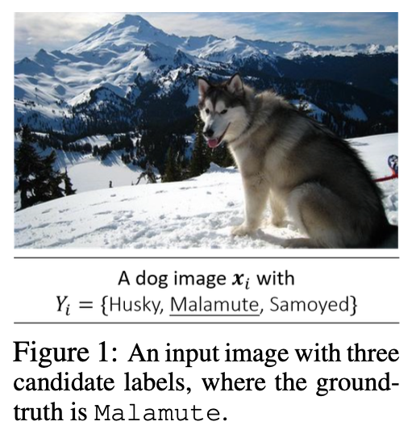
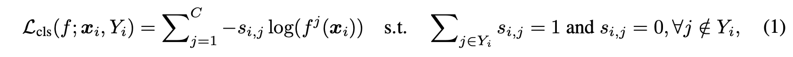
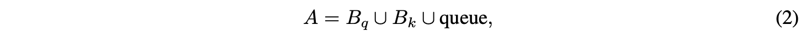
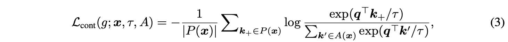
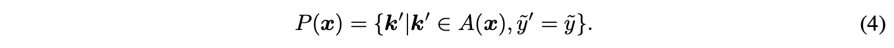
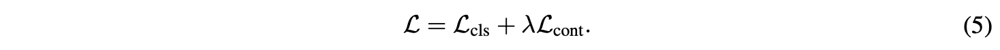
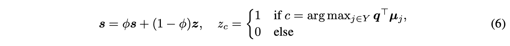
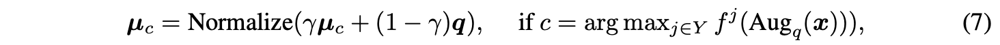
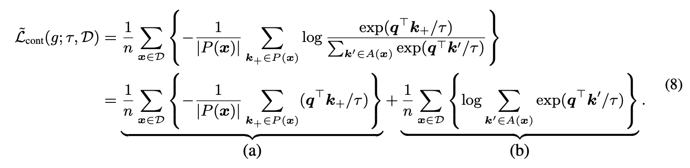
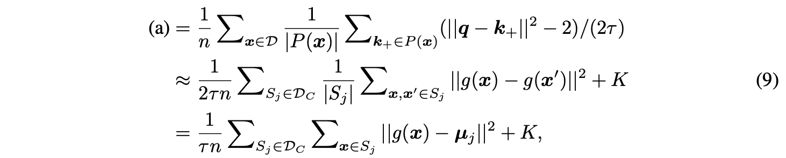

# CONTRASTIVE LABEL DISAMBIGUATION FOR PARTIAL LABEL LEARNING

## Abstract

部分标签学习（PLL）是一个重要的问题，它允许每个训练样本用一个粗略的候选集进行标记，这非常适合许多具有标签模糊性的现实世界数据注释场景。但 PLL 的性能往往落后于有监督学习。在这项工作中，作者通过在一个框架中解决 PLL 中的两个关键研究挑战——表示学习和标签消歧——来减小与有监督学习的差距。具体来说，这个提出的框架 PiCO 由一个对比学习模块和一个基于聚类中心的标签消歧算法组成。 PiCO 为来自同一类的示例生成紧密对齐的表示，并促进标签消歧。从理论上讲，这两个组件可以互相促进，并且可以从期望最大化（EM）算法的角度得到严格证明。

## 1 Introduction

如图 1 所示，人类可能很难从西伯利亚雪橇犬中识别出阿拉斯加雪橇犬。这导致的标签模糊性问题很普遍，但在许多应用中经常被忽视。部分标签学习（Partial Label Learning）就是针对这一问题提出，其中每个训练示例都配备了一组候选标签而不是确切的真实标签。可以说，PLL 问题在各种情况下被认为更常见和实用，因为它的注释成本相对较低。

PLL 的核心挑战是标签消歧，即从候选标签集中识别真实标签。现有方法通常需要良好的特征表示，并且在特征空间中更接近的数据点更有可能有着相同的真实标签。然而，不确定的标签必然会影响样本表示的学习，进而阻碍有效的标签消歧。迄今为止，很少有人努力解决这个问题。

但是反过来说，表示学习和标签消歧又是可以互相促进的。作者的框架 PiCO 为来自相同类的样本生成紧密对齐的表示，并促进标签消歧。具体来说，PiCO 封装了两个关键组件。首先，利用对比学习来进行部分标签学习，这在以前的 PLL 工作中是未探索的。这篇文章对比学习部分的正样本使用分类器的输出生成。基于对比学习到的嵌入，使用基于一种聚类中心的标签消歧策略。这种消歧策略其核心是，基于最接近的类中心逐步更新分类的伪目标。通过交替上述两个步骤，PiCO 收敛到具有高度可区分表示的解决方案，以实现准确分类。

> PLL 中的表示学习和标签消歧如果是互相依赖的，也就是模型依赖更好的标签消歧进行表示学习，而标签消歧又要依赖表示学习的结果，那么二者就会互相阻碍。但是如果我们的表示学习不依赖于标签消歧，而是从对比学习中学习表示（无监督的对比学习也不依赖标签），那么二者就会互相促进。
>
> 如果监督信号存在问题（带噪学习，部分标签学习），我们就不能通过监督信号学习到良好的表示，进而改进监督信号。那么我们可以考虑借助对比学习这一外部动力，使得“修正监督信号”和“样本表示学习”二者互相促进。

从理论上讲，作者证明了对比表示学习和基于聚类中心的标签消歧是互利的，并且可以从期望最大化（EM）算法的角度进行严格解释。首先，细化的伪标签通过准确地选择伪正样本来改进对比学习。这可以类似于 E-step，我们利用分类器的输出将每个数据示例分配给一个特定于标签的集群。其次，更好的对比性能反过来提高了表示的质量，从而提高了标签消歧的有效性。这可以从 M 步的角度来推断，其中对比损失通过聚类相似的数据示例来部分最大化似然性。

## 2 Background

用 $\mathcal X$ 表示输入所在的特征空间，$\mathcal Y=\{1,2,...,C\}$ 表示输出所在标签空间。PLL 的训练数据集 $\mathcal D=\{(x_i,Y_i)\}^n_{i=1}$，其中 $x_i\in\mathcal X$，而集合 $Y_i\subset \mathcal Y$。PLL 的一个基础假设是：每个样本的 ground-truth label $y_i$ 必然包含于它的候选集 $Y_i$ 中。

作者认为 PLL 的关键挑战在于从候选集中找出正确的标签，所以构造了如下损失函数：

在训练过程中，作者给每一张图片 $x_i$ 分配一个正规化的向量 $s_i\in[0,1]^C$，用于表示一个样本属于各个类别的可能性，所以也称其为 pseudo target。在 $s_i$ 的基础上构造 CE loss。

在训练过程中 $s_i$ 会不断更新。理想情况下，$s_i$ 中正确标签对应的值应该越来越大。

## 3 Method

### 3.1 Contrastive Representation Learning for PLL

标签空间中的不确定性为学习表示设置了一个独特的障碍。在 PiCO 中，作者将 eq1 中的 CE 损失与一个对比损失项结合起来，有助于在嵌入空间中产生聚类效果。虽然在最近的文献中已经对对比学习进行了广泛的研究，但它在 PLL 领域仍未得到开发。

主要挑战在于正样本集的构建。在传统的监督 CL 框架中，可以根据真实标签轻松绘制正样本对。然而，这在 PLL 中并不简单。

**Training Objective**

在这篇论文的时代，对比学习最常见的模式如下。给定一个样本 $(x,Y)$，我们通过随机数据增强产生两个新 view，query view 和 key view，分别送入 query network $g(\cdot)$ 和 key network $g'(\cdot)$，生成的结果经过 L2-normalized 得到最终的 embedding $q=g(Aug_q(x))$ 和 $k=g'(Aug_k(x))$。

在结构上，query network 和 key network 继承分类器的卷积块，后接 prediction head（也称 projection head，大概是一个 MLP）。在参数上，key network 使用 query network 的动量更新。

生成的 embedding 中的 k 保存在一个队列中。在训练过程中最新生成的 k 会替代掉队列中最老的 k。而 k 又是由动量更新的 key network 生成的，这样就可以尽量维持队列中的 embedding 的一致性，并且尽量多地保存 embedding。

最终的 contrastive embedding pool 如下：

其中 $B_q$ 和 $B_k$ 是当前 mini-batch 生成的 qk embedding。对于一个样本 $x$，它的对比损失就是它的 q embedding 和 pool A 中其他的 embedding 的对比损失：

其中，$P(x)$ 是正样本集，$A(x) = \{A-\{q\}\}$ ，$q=g(Aug_q(x))$。

>一个样本的两个 view $Aug_q(x)$ 和 $Aug_k(x)$ 之间尽量相似，和其他样本尽量不相似。
>
>对比损失中分子部分可以理解为一个样本的 embedding 和它的正样本的 embedding 的相似程度，分母则是该样本和所有其他样本的 embedding 的相似程度。实际上，对比学习中的正样本只有这个样本它自己，因为代理任务是 instance discrimination。想要对比损失小，就要自己的 q 和 自己的 k 尽量相似（点积大）而和其他样本的 k 尽量不同。
>

**Positive Set Selection**

在半监督对比学习中，一个样本的正样本是这个样本自身，负样本是其他所有样本。而在有监督学习中，已经有研究表明，如果把同类别的所有样本都作为该样本的正样本，其他非同类别的样本作为负样本，则有助于有监督学习。

在这个结论下，PLL 就有必要生成更“准确”的正样本集，以提高对比学习的效果。作者使用的方法是把模型对样本的预测当成这个样本的类别，正样本集就是预测类别相同的样本。具体来说，一个样本 $x$ 的预测标签 predicted label $\tilde y = \arg\max_{j\in Y}f^j(Aug_q(x))$，则正样本集按如下规则选出：

其中 $\tilde y '$ 表示样本 $k'$ 的 predicted label。从样本 $x$ 的 contrastive embedding pool 中选出那些 predicted label 和自己一样的样本，组成正样本集。这种选择方法还被作者证明是理论上合理的。

最终总损失由 eq1 的分类损失和 eq3 的对比损失组成：

### 3.2 Prototype-based Label Disambiguation

在理想情况下，对比损失可以让各个样本的 embedding 产生聚类效应。各个聚类中心称为 prototype。在训练过程中，根据每个样本的 embedding 和各个prototype 的相似程度，决定它的 pseudo target。同时根据这个样本 的 embedding 更新最相似的类别的 prototype。

**Pseudo Target Updating**

$s$ 是 pseodo target，$z$ 是一个 one-hot 向量，样本表示 $q$ 最相近的聚类中心 $\mu_j$ 对应了 1 项。$s$ 通过 EMA 的方式更新。

**Prototype Updating**

计算聚类中心的理想方法应该是在每次迭代中对所有 embedding 重新聚类，得到新的聚类中心。但是这会产生大量的计算量。所以，作者以 EMA 的方法更新 prototype：

其中 $c$ 类的动量原型 $μ_c$ 由归一化 embedding $q$ 的移动平均值定义，其预测类符合 $c$。$γ$ 是一个超参数。

## 5 Why PiCO Improves Partial Label Learning？

在本节中，我们提供了关于为什么对比原型有助于消除真实标签歧义的理论依据。 我们展示了对比学习中的对齐特性（Wang & Isola，2020）本质上最小化了嵌入空间中的类内协方差，这与经典聚类算法的目标一致。 它促使我们通过期望最大化算法来解释 PiCO。 为了看到这一点，我们考虑一个理想的设置：在每个训练步骤中，所有数据示例都是可访问的，并且增强副本也包含在训练集中，即 A = D。然后，对比损失计算为：

为了方便，作者这里不使用含有 queue 的 $A$ 而是直接在整体数据集 $D$ 上计算对比损失。将 $\log \frac{exp(\cdot)}{\cdot}$ 拆开可得：

注意，各种 $q$ 和 $k$ 都是 L2-normalized embedding vector，也就是模为 1。所以有如下性质：
$$
q\cdot k = (\|q-k\|^2-2)/2
$$
于是 eq8 中的 (a) 项可以写作：

其中最后一个等式可以由 $q\cdot k$ 的性质得出。

