# Tripartite: Tackle Noisy Labels by a More Precise Partition

## 1 Introduction

基于样本选择的方法通过将训练数据划分为干净和嘈杂的子集，然后以不同的方式将它们用于网络训练来解决嘈杂的标签。主流划分标准有两种类型：

* Small-loss criterion：假设在训练过程中噪声标记数据的损失显着高于干净数据的损失。因此，他们试图找到一个阈值 T，并选择损失 < T 的样本作为干净的数据。其他被视为嘈杂的标记数据。

* 高斯混合模型（GMM）标准：噪声数据损失的统计分布与干净数据损失的统计分布不同。它旨在通过拟合混合模型来找出样本有噪声或干净的概率。

然而，我们观察到许多现实世界的噪声标签都存在于相似类别之间，尤其是困难样本。例如，海豚被错误标记为鲸鱼，如图 1 所示。**本文将“困难样本”定义为分布在决策边界附近且难以区分的数据**。

由于困难样本的存在，现有的基于样本选择的方法存在两个缺陷：

* 训练数据划分质量低。他们很可能仅根据损失将噪声标注的困难样本误认为是干净的样本，反之亦然。这会降低网络的性能，因为网络将学习某些嘈杂的标签并丢弃一些干净的数据。
* 噪声标记数据的无效使用。小损失准则通常会丢弃嘈杂的样本，这是对有价值信息的浪费。 GMM 准则应用半监督学习通过为样本分配伪标签来重用有噪声的标记样本。但它在很大程度上依赖于网络的辨别能力。不正确的重新标记也会对网络造成严重损害。

为了解决上述问题，我们提出了一种新方法：Tripartite，主要解决现实世界数据集中的困难样本。由于困难样本分布在决策边界周围，因此在早期训练阶段各种网络对困难预测通常是不一致的。同时，网络对一个简单的噪声样本的预测通常与给定的标签不一致。

 基于这一观察，Tripartite 可以将训练数据划分为 hard、noisy 和 clean 的子集。 它具有提高干净和嘈杂子集质量的优势。 为了有效地使用数据，Tripartite 对困难子集中的样本应用低权重训练策略，并对噪声子集中的样本采用自监督训练策略，而不使用给定的标签。 因此，Tripartite 旨在最大限度地减少噪声标签的危害并最大化噪声标签数据的价值。 

主要有以下三个方面的贡献：

* 一种新颖的划分标准，它将训练数据分为三个子集：hard、noisy 和 clean。 它缓解了其他标准的硬样本选择问题，并大大提高了干净和嘈杂子集的质量。
* 设计了针对困难样本的低权重训练策略和针对噪声样本的自监督训练策略，旨在最小化噪声标签的危害并最大化噪声标签数据的价值。
* 为了模仿真实世界数据集中困难样本的噪声标签，本文在 CIFAR 数据集上创建了一种合成的依赖于类别的标签噪声，称为 realistic noise。这种噪声根据不同类别之间的相似性以一定的比例翻转样本标签。

## 2 Related Work

已经有许多研究来解决嘈杂的标签。他们都试图降低噪声标签的影响，以提高方法在训练阶段的识别性能。为此，提出了两种不同的想法。

**Loss correction** 具体方法包括：

* 噪声转移矩阵。噪声转移矩阵方法构建标签转换矩阵来估计噪声标签在多个类之间转换的可能性。 F-correction 通过将转移矩阵与前向传播中的 softmax 输出相乘来执行前向校正。后来，Hendrycks 等人使用一个小的干净数据集改进了噪声转移矩阵。
* 鲁棒损失函数。鲁棒损失方法旨在设计对噪声标签具有鲁棒性的损失函数，例如平均绝对误差 (MAE) 、重新加权 MAE 的 Improved MAE、广义交叉熵损失 (GCE) 是MAE的推广，对称交叉熵在通常的交叉熵损失中增加了一个反向交叉熵项。
* 标签校正。标签校正方法尝试在训练期间根据网络预测来校正噪声标签。Joint optimization 学习网络参数并同时推断出真实标签。PENCIL 采用标签概率分布来监督网络学习，并通过每个时期的反向传播来更新这些分布。受“早期学习”的启发，ELR+ 在早期训练阶段使用网络预测来纠正噪声标签。

上述方法没有将训练数据区分为干净和嘈杂的子集。他们可能会错误地纠正干净数据的损失，并在训练数据中引入新的噪声标签。因此，提出了样本选择方法。

**Sample selection** 这些方法试图根据特定的划分标准将训练数据划分为“干净”和“嘈杂”的子集。之后，他们应用不同的策略分别在两个子集上训练模型。现有的划分标准主要基于训练损失，例如小损失准则和高斯混合模型 (GMM) 准则。小损失准则通过设置阈值 T 来选择损失小的训练样本作为干净样本。特别是，MentorNet 预训练了一个教师网络，用于选择干净的样本来指导学生网络的训练。 Co-teaching 训练两个网络，其中每个网络选择小损失样本来馈送其对等网络以更新参数。此外，Co-teaching+ 强调不一致性对网络的帮助，而 JoCoR 强调两个网络的一致性。然而，所有这些方法都只使用损失较小的数据进行训练，而没有考虑损失较大的数据。同时，找到一个可行的 T 是非常具有挑战性的。 GMM 假设噪声标记数据和干净数据的损失分布分别遵循两个正态分布。 DivideMix 使用两个网络，每个网络在训练中为另一个选择数据，然后应用半监督方法来学习带噪声的标记数据。它极大地提高了网络的性能。然而，在现实世界的数据集中，嘈杂的标签经常出现在相似的类别之间，例如 CIFAR-100 中的鲸鱼和海豚、橡树和枫树。 GMM 可能会误认为硬噪声样本和硬干净样本，因为它们的损失差异很小。它导致训练数据分区质量低下。相比之下，我们提出了将训练数据划分为干净、困难和嘈杂的子集的三分区标准。更精确的划分可以有效降低噪声标签对网络训练的危害。

## 3 The Proposed Method

### 3.1 Preliminaries

### 3.2 Distribution of Training Data

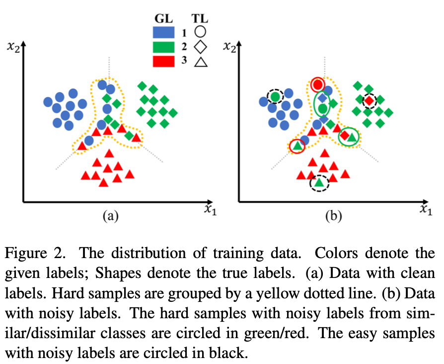

训练数据包括困难样本和简单样本。由于困难样本共享两个或更多相似类的某些特征，它们分布非常接近决策边界。图 2（a）说明了数据分布，其中困难样本由黄色虚线分组，其他为简单样本。

对于简单的样本，有两种情况。

* 带有干净标签的简单样本。由于标签信息与样本特征相当相关，因此网络可以在早期训练阶段拟合这些样本。他们的损失应该是训练集中最小的。
* 带有嘈杂标签的简单样本，在图 2(b) 中用黑色圈出，例如，在图 1 中，woman 被错误标记为 keyboard。由于给定标签提供的信息与这些特征无关样本，它们是训练数据中的异常。他们的损失应该是训练集中最大的。

对于困难样本，有三种情况。 

* 带有干净标签的困难样本。标签信息和样本特征是相关的。由于分布在决策边界附近，它们也与类似的类有一些共同的特征。因此，这些数据的特征与这两个类别有关。
* 来自相似类别的带有噪声标签的困难样本，在图 2(b) 中以绿色圈出。它们分布在决策边界附近，并被错误地标记为相似的类。因此，它们的特征在一定程度上与这两个类有关。观察表明，两个困难样本的损失都大于简单干净样本的损失，但低于简单噪声样本的损失。
* 具有来自不同类别的嘈杂标签的硬样本，在图 2(b) 中用红色圈出，例如，dolphin 被错误地标记为 woman。这些样本也分布在靠近决策边界的位置，但被错误地标记为不同的类别。给定标签提供的信息与这些样本的特征无关，这类似于简单噪声样本的情况。

以上分析说明了训练数据的五种可能情况，两种简单样本和三种困难样本。为了提高数据划分的质量并最大限度地减少噪声标签的危害，我们将这五个案例根据损失分为三个子集。它们是：困难子集，包括带有干净标签的困难样本，以及来自类似类别的带有噪声标签的困难样本；噪声子集，包括带有嘈杂标签的简单样本，以及来自不同类别的带有噪声标签的困难样本；干净子集，包括带有干净标签的简单样本。可以看到存在一个顺序：噪声子集的损失 > 困难子集的损失 > 干净子集的损失。在实践中，每个 epoch 都有两个阈值 T1 和 T2，其中 T1 < T2。然后，可以对训练数据进行分区，如图 1 所示。

### 3.3 Tripartition method and criteria

理论上，训练数据可以根据 T1 和 T2 划分为三个子集。 然而，选择可行的 T1 和 T2 并非易事。

对此我们可以借用这一现象：不同网络对困难样本的预测通常是不一致的。 损失和训练数据的网络预测之间存在相关性（这解释了为什么二分法难以处理困难样本）。 因此，确定 T1 和 T2 就变成了衡量不同网络预测的一致性。 因此，我们提出了一种三分法和选择标准。 Tripartite 的逻辑如图 3 所示。我们训练了两个具有不同初始化的网络。 他们在每个时期都给出了自己的预测。 训练数据相应地分为三个子集。

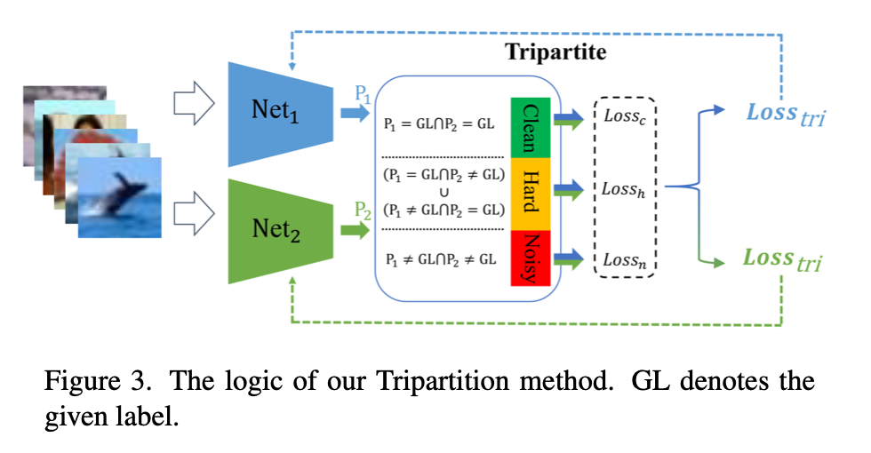

**Selction criterion for hard subset**

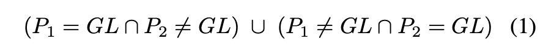

困难子集包括具有干净标签的困难样本和来自相似类别的具有噪声标签的困难样本。 这些样本的特征和标签提供的信息有些相关，但不是很一致。 因此，不同的网络可能无法对此类样本给出一致的预测，尤其是在早期训练阶段。 然后我们应用两个网络的不一致预测选择困难子集。 所选数据的损失应遵循 T1 < loss < T2。 我们的实验表明，随着网络判别性能的提高，这些数据的数量会逐渐减少。 

**Selection criterion for noisy subset**

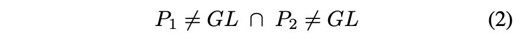

噪声子集主要包括带有噪声标签的简单样本和来自不同类别的带有噪声标签的困难样本。 由于这些样本的特征与标签提供的信息不相关且不一致，因此网络在早期训练阶段将无法拟合这些数据。 因此，网络的预测将与给定的标签不一致。 然后我们应用这种不一致性选择它们。 所选数据的损失应遵循 loss > T2。

**Selection criterion for clean subset**

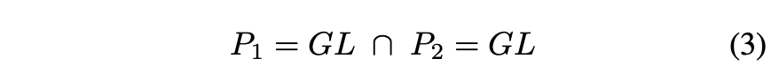

干净数据主要包括带有干净标签的简单样本。 由于这些样本的特征和标签信息相当一致，网络可以在早期训练阶段学习数据特征和标签之间的映射。 因此，两个网络和给定标签的预测应该是一致的。 然后我们应用这种一致性选择干净的数据。 所选数据的损失应遵循 loss < T1。

### 3.4 Learning strategies for three subsets

**Learning strategy for hard subset**

困难数据子集包括带有噪声标签和干净标签的样本。 很难区分它们。 我们希望利用困难数据的有价值信息来提高网络的判别能力，同时降低该子集中噪声标签的危害。 因此，我们对硬数据应用了一个低权重的交叉熵损失函数。

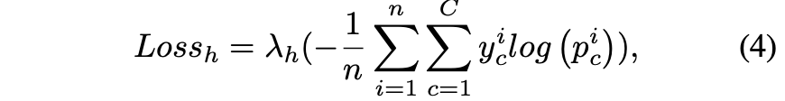

**Learning strategy for noisy subset**

为了降低噪声标签的影响，许多工作应用半监督学习来用伪标签替换给定的标签。 然而，伪标签的质量很大程度上依赖于网络的判别能力。 当判别能力较弱时，可能会在训练数据中引入新的噪声标签。 相反，我们设计了一种自我监督的方法来学习这些数据而不使用给定的标签。

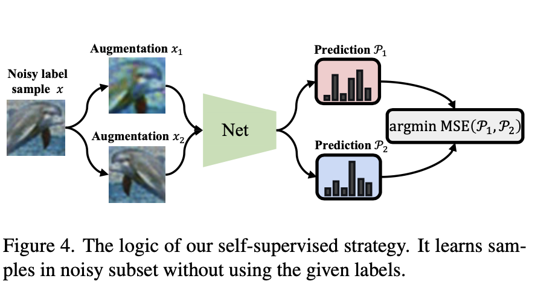

给定图 4 中所示的噪声标记样本 $x$，通过旋转、翻转、裁剪、去饱和、对比度、模糊和 MixUp 等随机增强它。这些增强可以创建许多正样本对。它们被输入网络，该网络预测每个增强的概率分布 $P = (p_1, p_2, ..., p_C)$。 为了从相似样本中学习共同的判别特征，我们使用 MSE 损失函数来约束两个概率分布 $⟨\bar P，\hat P⟩$ 的一致性。

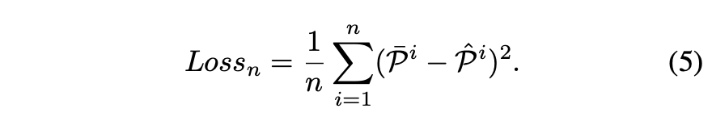

**Learning strategy for clean subset**

Tripartite 的干净子集质量很好，直接用 CE。

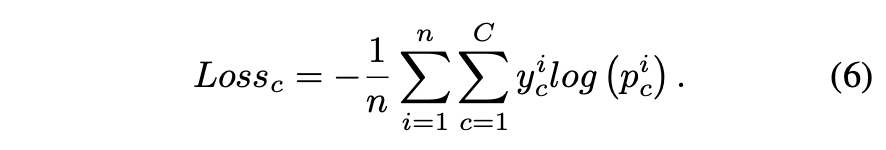

最后加到一起：

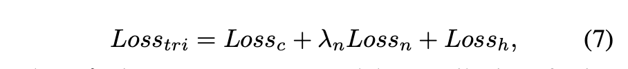

其中 $\lambda_n$ 用于控制噪声子集的 contribution。在实验部分说到， $\lambda_n$ 从 $\{1,10,20,40,60,80,100\}$ 里选，$\lambda_h$ 在 CIFAR 数据上设置为 0.6。

## 4 Experiments

### 4.1 Implementation details and datasets

### 4.2 Comparison with SOTA methods

### 4.3 Ablation study

**The quality of training data partition**

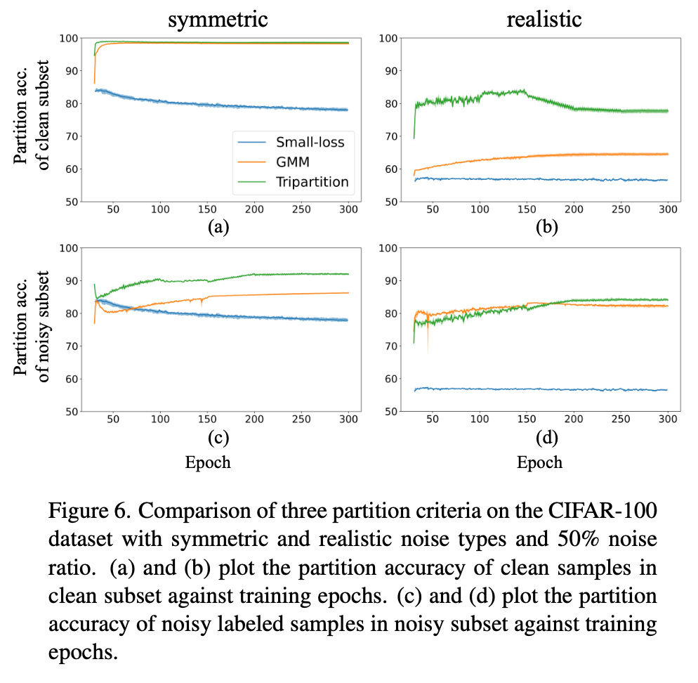

为了测试干净和嘈杂子集的划分精度，我们将 Tripartite 与小损失准则和 GMM 准则进行了比较。结果如图 6 所示。我们可以看到，Tripartite 在两个干净的子集上都实现了最佳的分区精度。在对称噪声上，我们的 Tripartite 略微优于 GMM 标准。原因是对称噪声是由对称标签转移产生的。噪声标签和干净标签在损失方面可以更好地拟合 GMM 中的两个高斯分布。小损失标准是最差的，因为它严重依赖于 R% 的选择。值得注意的是，Tripartite 的表现比其他人更好，尽管在对称类型上具有来自相似类别的噪声标签的困难样本数量较少。在现实噪声上，tripartite 在干净子集上大大优于其他两个标准。随着困难噪声标记数据的数量变得越来越大，它缩小了训练集中干净和噪声标记数据的损失之间的差异，然后进一步削弱了两个基于损失的标准的区分。

**Training strategy for noisy subset**

作者还针对噪声子集的处理方法做了实验。有三种方法：co-teaching 采用的丢掉噪声子集的方法；JoCoR 采用的在噪声子集上进行半监督学习的方法，DivideMix 也采用了类似方法；本文的自监督方法。结果如表 7，自监督最好。

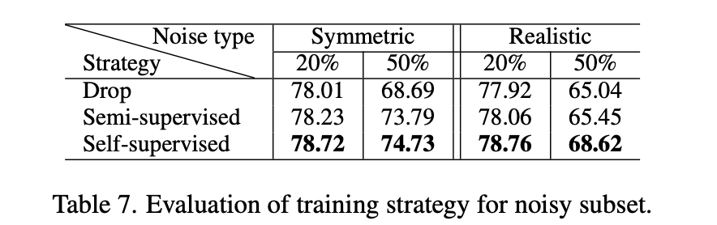

