# UNICON: Combating Label Noise Through Uniform Selection and Contrastive Learning

这篇论文的耐噪学习方法融合了多个半监督和自监督的工作，包括：

* FixMatch：一致性正则方法，对每个样本采用两种不同的数据增强，弱增强（翻转平移），强增强（RandAugment+CutOut）。模型对弱增强的输出作为伪标签，与模型对强增强的输出计算 CE。
* FlexMatch：半监督方法，以不同的置信度选取不同类别的伪标签。带噪学习中则体现为以不同的 loss 阈值选取不同类别的样本。
* SimCLR：自监督方法，骨干网 backbone net 后接 projection head，使用这个结果计算对比损失。

## 4 Proposed Method

### 4.1 Uniform Sample Selection

现有的问题：现有的基于 loss 的样本筛选方法可能导致某一困难类很少被选，选出的干净子集存在类别不均衡的问题。如果一个类别特征较难学习，那么这类的样本的 loss 必然相对较大，使用 small-loss critrion 时大量排除这类样本，最终导致该类稀缺，样本不均衡。

Unicon 使用两个对等网络的输出的平均值作为整体预测 $y_i$，与带噪数据集的 given labels $p_i$ 计算 JS 散度：

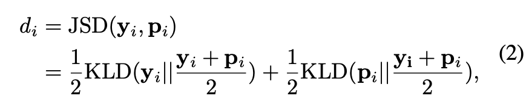

这个 JS 散度会用于判断干净样本与噪声样本。之前的工作使用 loss 判断，但是 loss 的值域是 0 到正无穷，可能会需要正规化，JS 散度则是 0-1 的值域。

接下来作者计算一个阈值 $d_{cutoff}$，用于估计有多少样本值得被加入有监督学习：

当模型的预测和 given labels 差别较大时，JS 散度也会较大，则 $d_{avg}$ 的值也会较大。当 $d_{avg}$ 大于一个预先设定的 $d_{\mu}$ 时，$d_{cutoff}$ 就会在一定程度上减小。也就意味着只有更少的样本值得被加入有监督学习。

在所有样本中，$d_i<d_{cutoff}$ 的样本数量记为 $|d_R|$ ，每个类别都选出 $d_i$ 较小的样本，比例为 $|d_R|/N$。保证每个类别被加入有监督学习的样本比例都是相同的，不会出现某一类较为难学，导致有监督中不含该类样本的情况。

作者做了这种样本筛选方法与 DivideMix 的样本筛选方法之间的对比实验。实验环境是 90% 噪声的 cifar10。图 2 ab 显示了选取的干净样本中实际干净样本和噪声样本的比例，图 c 显示了为标签的召回率，图 d 显示的是测试集准确率。

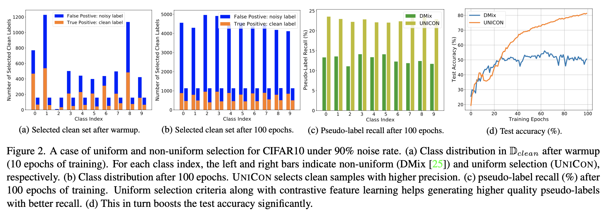

> 因为所有类的取样比例相同，都是 $|d_R|/N$，所以 UNICON 有个潜在的强假设：每类的噪声率相同。这一假设有些不符合实际。
> 我们在样本选择阶段究竟要做什么？我们要做的是选出干净样本。但是干净样本的类别不均衡是必然的。那么设定一个统一阈值筛选样本的方法能否符合每一类的噪声率呢？从图 2 中的实验来看不能。
>
> 逐类统计噪声率的方法不可行。所以我想可以通过“学习效果”来估计每类的噪声率。一个类别的学习效果在带噪学习中由两个因素影响：类别本身的学习难度和类内噪声率。而这两个因素在现实噪声环境下是正相关的。所以一个类别的学习效果越差，可以认为类内噪声率就越高。

### 4.2 SSL-Training

作者在半监督部分融合了三个技术：FixMatch，MixUp 和 SimCLR 的对比学习方法。

仿照 FixMatch，UNICON 对所有样本各做了四个数据增强：

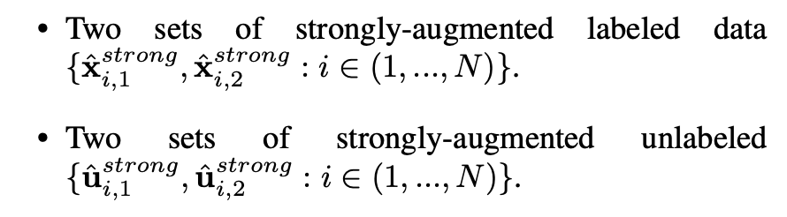

弱增强用于标签修正（label refinement）和生成伪标签，强增强用于更新模型参数。

**Label Refinement**

使用 labeled data 中的每个样本的两个弱增强生成一个预测标签，再与 given label 加权，形成 refined label：

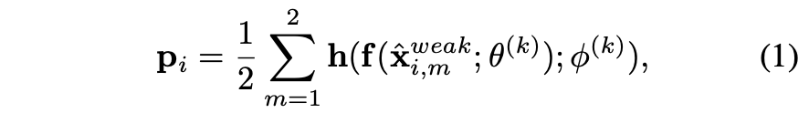

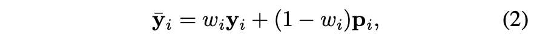

加权时使用的权重 $w_i$ 由 JS 散度决定：

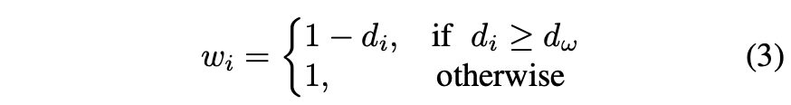

**Pseudo Label**

只为 unlabeld data 添加伪标签。使用两个对等网络对每个样本的两个弱增强的预测结果的平均值作为伪标签：

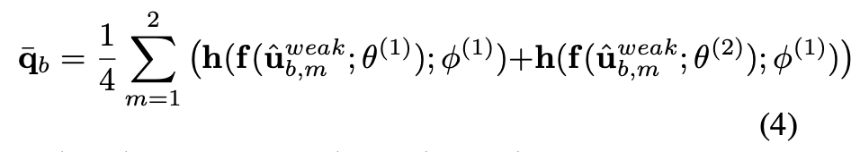

这里的式子可能有问题，两个预测使用的是不同的 $\theta$ 但却是相同的 $\phi$。我推测 $h(\cdot)$ 是带有温度参数 $\phi$ 的 softmax，这样两个网络含有相同的 $\phi$ 就也比较合理。

**MixUp**

Label refinement 给 labeled data 改进了标签，pseudo label 给 unlabeled data 添加了标签。现在 MixUp 来混合样本的特征：

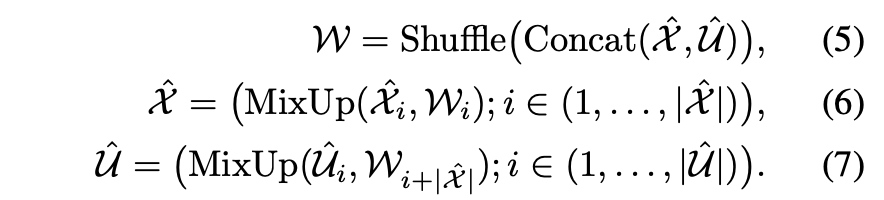

此时混合的样本特征都是经过强数据增强之后的样本特征。

至此所有样本得到了新的标签和新的特征。

**Loss Function**

Labeled data 使用 H 即 CE 损失，unlabeled data 使用 MAE：

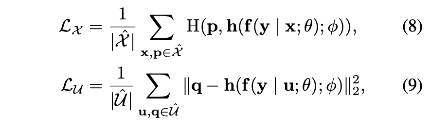

同时，使用正则项 $L_{reg}$ 防止模型把所有样本预测为相同类别：

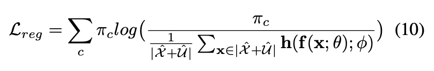

这些构成了半监督损失：

同时，作者还希望在 unlabeled data 部分加入对比损失，目的是减少模型对于伪标签的依赖。噪声样本的筛选势必存在偏差，伪标签也总会出错，所以作者希望对比损失可以让模型从另一个角度学习样本特征：

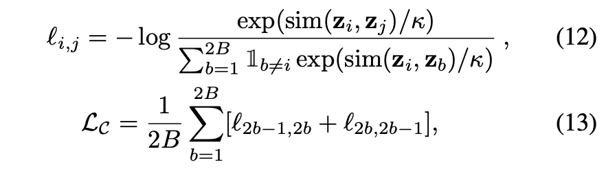

对比学习就是希望模型可以知道：每个样本和自己的数据增强相似，而与其他样本不同。相似与否由 sim 函数判断，模型对于一个样本的判断由 $z_i$，$z_j$ 和 $z_b$ 表示。

模型输出的样本特征 $f(x_{i,1};\theta)$，经过一个 projection head $g(\cdot,\phi)$ 得到 $z_i$，$z_j$ 和 $z_b$。这个 projection head 是对比学习中被反复证明有效的一个结构，把模型提取的样本特征降维，提高对比学习的效果。

最终把各个损失函数加到一起，得到最终的损失函数 $L_{tot}$：

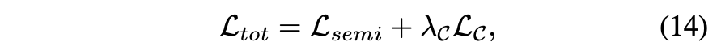

以下是模型总览图：

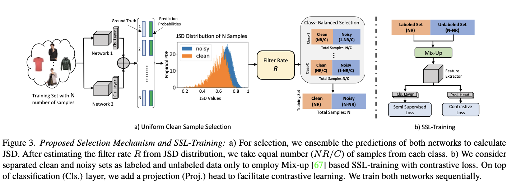
