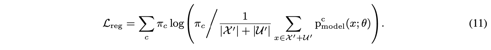

# Dividemix: Learning with Noisy Labels as Semi-Supervised Learning

DivideMix 是一个标准的样本筛选+半监督耐噪方法：

* 样本筛选方法：GMM-loss 用于区分是否是噪声样本；
* 半监督方法：MixMatch。

具体分为四个阶段：

* Co-divide：在 co-teaching 的两个 peernet 上各自使用 GMM 判别每个样本属于干净样本的概率 $w_i$；
* Co-refinement：对于干净样本，$M$ 个数据增强的预测标签和原标签按 $w_i$ 加权；
* Co-guessing：对于噪声样本，平均两个 peernet 的 $M$ 个数据增强的预测标签；
* MixMatch：随机两个样本做线性差值，得到新的样本和样本标签。

四个 trick：

* 防止模型 warmup 阶段过度自信的 confidence penalty；
* 对 co-refinement 和 co-guessing 得到的标签使用锐化函数，也就是 temperature parameter；
* 使用正则化项防止模型把所有样本预测为同一类。
* 干净样本和它们的 co-refinement 使用 CE 计算损失，噪声样本和它们的 co-guessing 使用 MSE 计算损失。
* CE 和 MSE 的比例随训练进程发生改变。

## Abstract

众所周知，深度神经网络需要注释。在使用深度网络学习时，人们已经做出了许多努力来降低注释成本。两个突出的方向包括带噪声标签的学习和通过利用未标记数据的半监督学习。在这项工作中，我们提出了 DivideMix，这是一种通过利用半监督学习技术来学习嘈杂标签的新框架。特别是，DivideMix 使用混合模型对每个样本的损失分布进行建模，以将训练数据动态划分为具有干净样本的标记集和具有噪声样本的未标记集，并在标记数据和未标记数据上训练模型一种半监督的方式。为了避免确认偏差，我们同时训练两个不同的网络，其中每个网络使用来自另一个网络的数据集划分。在半监督训练阶段，我们通过分别对标记和未标记样本执行标签协同改进和标签协同猜测来改进 MixMatch 策略。在多个基准数据集上的实验证明了对最先进方法的实质性改进。

## 1 Introduction

DivideMix 以半监督的方式处理标签噪声问题。DivideMix 丢弃了噪声样本的标签，

训练深度神经网络 (DNN) 的显着成功很大程度上归功于带有人工注释标签的大型数据集的收集。但是，使用高质量注释标记大量数据非常昂贵且耗时。另一方面，存在用于挖掘带有标签的大规模数据的替代且廉价的方法，例如查询商业搜索引擎（Li et al., 2017a），下载带有标签的社交媒体图像（Mahajan et al., 2018），利用机器生成的标签（Kuznetsova et al，2018），或使用单个注释器来标记每个样本（Tanno et al., 2019）。这些替代方法不可避免地会产生带有噪声标签的样本。最近的一项研究 (Zhang et al., 2017) 表明，DNN 很容易过度拟合嘈杂的标签并导致泛化性能不佳。

现有的噪声标签学习方法（LNL）主要采用损失校正方法。一些方法估计噪声转移矩阵并使用它来校正损失函数（Patrini et al., 2017; Goldberger & Ben-Reuven, 2017）。然而，正确估计噪声转移矩阵具有挑战性。一些方法利用 DNN 的预测来纠正标签并相应地修改损失（Reed 等人，2015；Tanaka 等人，2018）。这些方法在高噪声比下表现不佳，因为来自 DNN 的预测会主导训练并导致过度拟合。为了克服这一点，Arazo 等人。 (2019) 采用 MixUp (Zhang et al., 2018) 增强。另一种方法选择或重新加权样本，以便噪声样本对损失的贡献较小（Jiang et al., 2018; Ren et al., 2018）。一个具有挑战性的问题是设计一个可靠的标准来选择干净的样品。已经表明，DNN 在拟合标签噪声之前倾向于先学习简单的模式（Arpit 等人，2017）。因此，许多方法将损失小的样本视为干净的样本（Jiang et al., 2018; Arazo et al., 2019）。在这些方法中，Co-teaching (Han et al., 2018) 和 Co-teaching+ (Yu et al., 2019) 训练了两个网络，每个网络在一个小批量中选择小损失样本来训练另一个网络。

另一个旨在降低注释成本的活跃研究领域是半监督学习（SSL）。在 SSL 中，训练数据由标记样本和未标记样本组成。通过强制模型对未标记数据产生低熵预测 (Grandvalet & Bengio, 2004) 或对扰动输入的一致预测 (Laine & Aila, 2017; Tarvainen & Valpola, 2017; Miyato et al)，在利用未标记样本方面取得了重大进展。 ., 2019)。最近，Berthelot 等人。 (2019) 提出了 MixMatch，它将几种主要的 SSL 方法统一在一个框架中，并实现了最先进的性能。

尽管 LNL 和 SSL 有各自的进步，但它们之间的联系尚未得到充分探索。 在这项工作中，我们提出了 DivideMix，它以半监督的方式解决了标签噪声的学习问题。 与大多数现有的 LNL 方法不同，DivideMix 丢弃了很可能有噪声的样本标签，并利用噪声样本作为未标记数据来规范模型以防止过度拟合并提高泛化性能。 这项工作的主要贡献是：

* 我们提出了 co-divide，它同时训练两个网络。对于每个网络，我们在其每样本损失分布上动态拟合高斯混合模型 (GMM)，以将训练样本分为标记集和未标记集。然后使用划分的数据来训练另一个网络。 Co-divide 使两个网络保持发散，以便它们可以过滤不同类型的错误并避免自我训练中的确认偏差。
* 在 SSL 阶段，我们通过标签协同改进和协同猜测来改进 MixMatch，以解决标签噪声问题。对于带标签的样本，我们使用由 GMM 引导的网络对另一个网络的预测来改进它们的真实标签。对于未标记的样本，我们使用两个网络的集合来对其标签进行可靠的猜测。
* 我们通过实验表明，DivideMix 在具有不同类型和级别的标签噪声的多个基准测试中显着提升了最先进的结果。我们还提供广泛的消融研究和定性结果，以检查不同成分的效果。

## 2 Related Work

### 2.1 Learning with Noisy Labels

大多数现有的训练带有噪声标签的 DNN 的方法都试图纠正损失函数。校正可以分为两种类型。第一种类型平等地对待所有样本，并通过重新标记噪声样本显式或隐式地纠正损失。对于重新标记方法，噪声样本使用有向图模型 (Xiao et al., 2015)、条件随机场 (Vahdat, 2017)、知识图 (Li et al., 2017b) 或 DNN (Veit et al., 2017 年；李等人，2018 年）。但是，他们需要访问一小组干净的样本。最近，田中等人。 (2018) 和 Yi & Wu (2019) 提出了使用网络预测重新标记样本的迭代方法。用于显式损失校正。里德等人。 (2015) 提出了一种引导方法，该方法通过模型预测来修改损失，Ma 等人。 （2018）通过利用特征子空间的维度来改进引导方法。帕特里尼等人。 （2017）估计用于损失校正的标签损坏矩阵，以及 Hendrycks 等人。 （2018）通过使用一组干净的数据改进腐败矩阵。第二种类型的校正侧重于重新加权训练样本或分离干净和嘈杂的样本，从而校正损失函数（Thulasidasan et al., 2019; Konstantinov & Lampert, 2019）。一种常见的方法是将损失较小的样本视为干净的样本（Shen & Sanghavi，2019）。江等人。 （2018）通过为样本分配权重来训练导师网络来指导学生网络。任等人。 （2018）根据梯度方向重新加权样本。陈等人。 (2019) 应用交叉验证来识别干净的样本。阿拉佐等人。 （2019）通过使用混合模型对每个样本的损失进行建模来计算样本权重。韩等人。 （2018）训练了两个网络，它们在每个小批量中选择小损失样本来相互训练，Yu 等人。 （2019）通过更新网络的分歧数据来改进它，以保持两个网络的分歧。

与上述所有方法相反，我们的方法丢弃了很可能有噪声的标签，并利用有噪声的样本作为未标记的数据，以 SSL 方式规范训练。丁等人。 （2018）和孔等人。 (2019) 表明 SSL 方法在 LNL 中是有效的。然而，他们的方法在高噪声水平下表现不佳，而我们的方法可以更好地区分和利用噪声样本。除了利用 SSL，我们的方法还引入了其他优点。与自训练方法（Jiang 等人，2018 年；Arazo 等人，2019 年）相比，我们的方法可以通过训练两个网络相互过滤错误来避免确认偏差问题（Tarvainen & Valpola，2017 年）。与 Co-teaching (Han et al., 2018) 和 Co-teaching+ (Yu et al., 2019) 相比，我们的方法通过使两个网络在每个 epoch 隐式地相互教导（co-divide ）并在每个小批量（标签共同细化和共同猜测）中明确。

### 2.2 Semi-Supervised Learning

目前最先进的 SSL 方法主要是在未标注的数据上增加额外的损失项，也就是正则项，以调整模型。正则化分为两类：

* 一致性正则化，consistency regularization，强制模型对增强的输入数据产生一致的预测；
* 熵最小化，entropy minimization， 鼓励模型对未标记的数据进行高置信度的预测。

MixMatch 则是一种将一致性正则化、熵最小化和 MixUp 统一到一个框架中的方法。

```
关于一致性正则化：
Samuli Laine and Timo Aila. Temporal ensembling for semi-supervised learning. In ICLR, 2017.
Antti Tarvainen and Harri Valpola. Mean teachers are better role models: Weight-averaged consistency targets improve semi-supervised deep learning results. In NIPS, pp. 1195–1204, 2017.
Takeru Miyato, Shin-ichi Maeda, Masanori Koyama, and Shin Ishii. Virtual adversarial training: A regularization method for supervised and semi-supervised learning. IEEE Trans. Pattern Anal. Mach. Intell., 41(8):1979–1993, 2019.
关于熵最小化：
Yves Grandvalet and Yoshua Bengio. Semi-supervised learning by entropy minimization. In NIPS, pp. 529–536, 2004.
Dong-Hyun Lee. Pseudo-label: The simple and efficient semi-supervised learning method for deep neural networks. In ICML Workshop on Challenges in Representation Learning, volume 3, pp. 2, 2013.
MixMatch 和 MixUp：
David Berthelot, Nicholas Carlini, Ian J. Goodfellow, Nicolas Papernot, Avital Oliver, and Colin Raffel. Mixmatch: A holistic approach to semi-supervised learning. NeurIPS, 2019.
Hongyi Zhang, Moustapha Cisse ́, Yann N. Dauphin, and David Lopez-Paz. mixup: Beyond empirical risk minimization. In ICLR, 2018.
```

## 3 Method

在本节中，我们将介绍 DivideMix，这是我们提出的使用噪声标签进行学习的方法。 该方法的概述如图 1 所示。为了避免模型会累积错误的自我训练的确认偏差，我们同时训练两个网络通过 epoch 级隐式教学和批处理级显式教学来过滤彼此的错误 . 在每个 epoch，我们执行 co-divide，其中一个网络将嘈杂的训练数据集划分为干净的标记集 (X) 和嘈杂的未标记集 (U)，然后由另一个网络使用。 在每个小批量中，一个网络同时利用标记和未标记的样本来执行由另一个网络引导的半监督学习。 算法 1 描述了完整的算法。

### 3.1 Co-Divide by Loss Modeling


Arazo 等人 (2019) 将 two-component Beta Mixture Model (BMM) 拟合到最大归一化损失 l 以模拟干净和嘈杂样本的分布。 然而，我们发现 BMM 往往会产生不希望的平坦分布，并且当标签噪声不对称时会失败。 相反，高斯混合模型 (GMM) (Permuter et al., 2006) 可以更好地区分干净和嘈杂的样本，因为它具有分布锐度的灵活性。 因此，我们使用期望最大化算法将双分量 GMM 拟合到 l。 对于每个样本，其干净概率 wi 是后验概率 p(g|li)，其中 g 是均值较小（损失较小）的高斯分量。

```
Eric Arazo, Diego Ortego, Paul Albert, Noel E. O’Connor, and Kevin McGuinness. Unsupervised
label noise modeling and loss correction. In ICML, pp. 312–321, 2019.
```

我们通过在 wi 上设置阈值 τ 将训练数据分为标记集和未标记集。 但是，使用除以自身的数据训练模型可能会导致确认偏差（即3 模型很容易确认它的错误（Tarvainen & Valpola，2017）），因为被错误地分组到标记集中的噪声样本会由于模型过度拟合其标签而保持较低的损失。 因此，我们建议共同划分以避免错误累积。 在 co-divide 中，一个网络的 GMM 用于划分另一个网络的训练数据。 由于不同的（随机）参数初始化、不同的训练数据划分、不同的（随机）小批量序列和不同的训练目标，这两个网络彼此保持分歧。 发散为两个网络提供了过滤不同类型错误的不同能力，使模型对噪声更加鲁棒。

**Confidence Penalty for Asymmetric Noise.** 对于算法的初始收敛，我们需要通过使用标准交叉熵损失对所有数据进行训练来“预热”模型几个 epoch。 预热对对称（即均匀随机）标签噪声有效。 然而，对于非对称（即类条件）标签噪声，网络在热身期间会很快过拟合噪声并产生过度自信（低熵）的预测，这导致大多数样本的归一化损失接近于零（见图 2a） . 在这种情况下，GMM 无法根据损失分布有效区分干净和嘈杂的样本。 为了解决这个问题，我们通过在热身期间的交叉熵损失中添加一个负熵项 -H（Pereyra 等人，2017）来惩罚来自网络的自信预测。 模型对输入 x 的预测的熵定义为：


通过最大化熵，l 变得更加均匀分布（见图 2b）并且更容易被 GMM 建模。 此外，在图 2c 中，我们展示了当模型在热身后使用 DivideMix 再训练 10 个 epoch 时的情况。 所提出的方法可以显着降低干净样本的损失，同时保持大多数噪声样本的损失更大。

### 3.2 MixMatch with Label Co-Refinement and Co-Guessing

在每个 epoch，划分训练数据后，我们一次训练两个网络，同时保持另一个网络固定。给定一小批带有相应单热标签和干净概率的标记样本，{(xb, yb, wb); b ∈ (1, ..., B)}，以及一小批未标记样本 {ub; b ∈ (1, ..., B)}，我们利用 MixMatch (Berthelot et al., 2019) 进行 SSL。 MixMatch 通过将一致性正则化（即鼓励模型对受扰动的未标记数据输出相同的预测）和熵最小化（即鼓励模型输出对未标记数据的置信预测）与 MixUp（Zhang 等人，2018）增强相结合来利用未标记数据（即鼓励模型在样本之间具有线性行为）。

为了解决标签噪声问题，我们对 MixMatch 进行了两项改进，使两个网络能够相互学习。首先，我们在另一个网络产生的干净概率 wb 的指导下，通过将真实标签 yb 与网络的预测 pb （在 xb 的多个增强中平均）线性组合来对标记样本执行标签协同改进：


然后我们在精炼标签上应用锐化函数来降低它的温度：


第二，我们使用两个网络的 co-guess 来集成预测未标注样本，让标签更可靠。

在获得了由标记（未标记）样本及其精炼（猜测）标签的多个增强组成的 X^（和 U^）之后，我们遵循 MixMatch 来“混合”数据，其中每个样本与从组合的 mini 中随机选择的另一个样本进行插值 -X^ 和 U^ 的批次。 具体来说，对于一对样本 (x1, x2) 及其对应的标签 (p1, p2)，混合 (x', p') 的计算公式为：


用交叉熵计算 $\mathcal X'$ 的损失，用均方误差计算 $\mathcal U'$ 的损失。


在高噪声水平下, 将鼓励网络预测同一类以最小化损失. 为了防止将所有样本分配给单个类, 我们应用了 Tanaka 等人使用的正则化术语。 （2018）和阿拉佐等人。 (2019)，它使用均匀的先验分布 π（即 πc = 1/C）来规范模型在小批量中所有样本的平均输出: 



最终总损失如下: 


其中, 在训练过程中 $\lambda_r$ 固定为 1, 只调整 $\lambda_u$.

## 4 Experiments

### 4.1 Datasets and Implementation Details

我们在四个基准数据集上广泛验证了我们的方法，即 CIFAR-10、CIFAR-100、Clothing1M 和 WebVision。 CIFAR-10 和 CIFAR-100 都包含 50K 训练图像和 10K 大小为 32 × 32 的测试图像。根据之前的工作，我们对两种类型的标签噪声进行了实验：对称和不对称。对称噪声是通过用所有可能的标签随机替换一定百分比的训练数据的标签来产生的。请注意，对称标签噪声注入还有另一个标准，其中无法维护真实标签，我们也报告了结果（附录中的表 6）。不对称噪声旨在模仿现实世界标签噪声的结构，其中标签仅被相似的类别替换（例如鹿→马，狗↔猫）。

我们使用一个 18 层的 PreAct Resnet 并使用 SGD 对其进行训练，动量为 0.9，权重衰减为 0.0005，batch 大小为 128。网络训练了 300 个 epoch。我们将初始学习率设置为 0.02，并在 150 个 epoch 后将其降低 10 倍。 CIFAR-10 的预热期为 10 个时期，CIFAR-100 的预热期为 30 个时期。我们发现 DivideMix 引入的大多数超参数不需要进行大量调整。对于所有 CIFAR 实验，我们使用相同的超参数 M = 2、T = 0.5 和 α = 4。τ 设置为 0.5，除了 90% 的噪声比设置为 0.6 时。我们使用一个小的验证集从 {0, 25, 50, 150} 中选择 λu。

Clothing1M 和 WebVision 1.0 是两个带有真实世界噪声标签的大规模数据集。 Clothing1M 包含从在线购物网站收集的 100 万张训练图像，并带有从周围文本生成的标签。我们遵循之前的工作 (Li et al., 2019)，并使用带有 ImageNet 预训练权重的 ResNet-50。 WebVision 包含使用 ImageNet ILSVRC12 中的 1,000 个概念从网络上抓取的 240 万张图像。在之前的工作（Chen 等人，2019 年）之后，我们使用 inception-resnet v2（Szegedy 等人，2017 年）比较了 Google 图像子集的前 50 个类别的基线方法。培训细节在附录 B 中描述。
