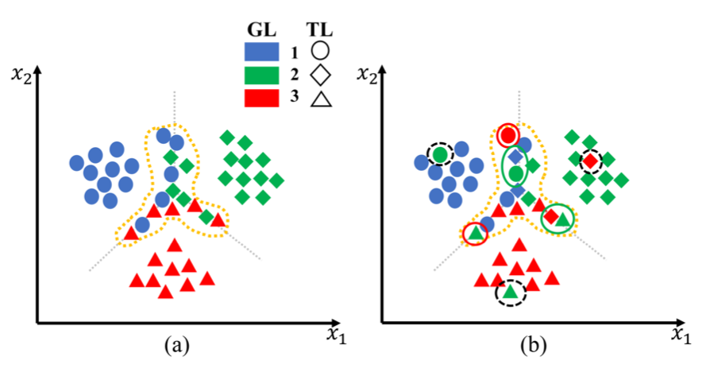

## 1 Distribution of Training Data

训练数据包括困难样本和简单样本。由于困难样本共享两个或更多相似类的某些特征，它们分布非常接近决策边界。图 2(a) 说明了数据分布，其中困难样本由黄色虚线分组，其他为简单样本。

对于简单样本，有两种情况。

* 带有干净标签的简单样本。由于标签信息与样本特征相当相关，因此网络可以在早期训练阶段拟合这些样本。他们的损失应该是训练集中最小的。
* 带有噪声标签的简单样本，在图 2(b) 中用黑色圈出，例如，woman 被错误标记为 keyboard。由于给定标签提供的信息与这些特征无关样本，它们是训练数据中的异常。他们的损失应该是训练集中最大的。

对于困难样本，有三种情况。 

* 带有干净标签的困难样本。标签信息和样本特征是相关的。由于分布在决策边界附近，它们也与类似的类有一些共同的特征。因此，这些数据的特征与这两个类别有关。
* 来自相似类别的带有噪声标签的困难样本，在图 2(b) 中以绿色圈出。它们分布在决策边界附近，并被错误地标记为相似的类。因此，它们的特征在一定程度上与这两个类有关。观察表明，两个困难样本的损失都大于简单干净样本的损失，但低于简单噪声样本的损失。
* 具有来自不同类别的嘈杂标签的困难样本，在图 2(b) 中用红色圈出，例如，dolphin 被错误地标记为 woman。这些样本也分布在靠近决策边界的位置，但被错误地标记为不同的类别。给定标签提供的信息与这些样本的特征无关，这类似于简单噪声样本的情况。

## 2 Corrupted Supervised Contrastive Learning

一般来说，半监督学习、带噪学习和部分标签学习（Partial Label Learning）等监督信号不完善的有监督学习都会面临一个问题：不完善的监督信号会导致模型学不到良好的表示，进而无法有效修正监督信号（比如给出伪标签，筛选噪声样本，筛选正确标签）。整个过程中含有两个不断循环的环节：

* 依赖监督信号学习表示，
* 修正监督信号。

这两个环节会形成负反馈，让学习过程陷入瓶颈。在这个情况下，我们就需要一种其他的助力来改善这个循环中的某个环节。比如找到更好的修正监督信号的方法，这也是大部分现有工作选择的路径。而另一个角度就是采用其他的表示学习方法，这个表示学习方法需要不依赖监督信号。

而对比学习是一种非常有效的表示学习方法，可以在不借助监督信号的前提下，学习到良好的样本表示。而第 1 节中根据数据分布判断简单样本和困难样本的方法，就十分依赖学习到的样本表示。

也就是说，我们可以借助对比学习学习到更好的样本表示，更好的样本表示可以更有效地修正监督信号（筛选噪声样本），更好的监督信号则可以进行更准确的有监督学习。在这个过程中，利用对比学习带来的新信息使两个环节可以互相促进。

## 3 SimSiam

早期对比学习十分依赖大量负样本。为了构造足够的负样本， SimCLR 使用大 batch size 和 EMA 更新的 teacher net，MoCo 则使用队列维护负样本集。同期出现的利用对比学习进行有监督学习的工作也受到负样本的局限（Supervised Contrastive Learning，Debiased Contrastive Learning）。随着 BYOL 的出现，人们发现对比学习中的负样本也并非必要。最终 SimSiam 给出了对比学习在无负样本情况下的工作原理：EM 算法。

对比学习的本质在于学习每一个样本的“完美”表示，这里我们用 $\eta_x$ 指代样本 $x$​ 的完美 embedding。考虑 eq5 形式的损失函数：
$$
L(\theta,\eta)=E_{x,\mathcal T}[\|\mathcal F_\theta(\mathcal T(x))-\eta_x\|_2^2]\tag 5
$$

其中 $\mathcal F$ 是参数为 $\theta$ 的网络，$\mathcal T$ 是数据增强，$x$ 是样本。我们在整个样本和数据增强的分布上计算期望 $E[\cdot]$。SimSiam 隐式地包含了两组变量，其中一组是模型参数 $\theta$，另一组则是 eq5 中的 $\eta_x$。这个变量表示的是样本 $x$ 的“完美” embedding，也就是最终我们希望得到的样本表示。

然而这个表示我们是不知道的，所以就成为了一个待求解的变量。这就是 EM 算法中的隐变量。举例来说，k-means 算法中的隐变量是样本究竟属于哪个类别，而另一个变量则是各个类别的中心；GMM 的隐变量是样本属于各个高斯分布的概率向量，而另一个变量则是各个高斯分布的均值和方差。SimSiam 的隐变量是每个样本的完美 embedding $\eta_x$，而另一个变量则是模型参数。

它们的共同的特点是，两组变量不能（不易）同时优化，找不到目标函数的极小值点。所以不得不把转化为固定一组变量，调整另一组，交替进行的子问题进行优化。还有很多机器学习算法可以被总结成类 EM 算法。在 SimSiam 中，优化步骤就是，先固定 $\eta_x$ 优化 $\theta$，再固定 $\theta$ 优化 $\eta_x$，也就是“两个潜在的子问题”。具体如下：

**Solving for $\theta$**

在这个子问题中，$\eta$ 是一个常数。使用 SGD 调整 $\theta$。所以 stop-gradient 操作也就非常自然了。

**Solving for $\eta$**

我们可以独立求解每一个 $\eta_x$，只要分别最小化这个期望 $E_{\mathcal{T}}[\|\mathcal F_{\theta^t}(\mathcal T(x))-\eta_x\|^2_2]$，注意，这是在数据增强 $\mathcal T$ 的分布上求期望。显然，这个期望的最小值点如下 eq9：

$$
\eta^t_x=E_{\mathcal T}[\mathcal F_{\theta^t}(\mathcal T(x))] \tag{9}
$$
**One-step alternation**

在每一步迭代中，首先从 $\mathcal T$ 的分布中随机取出一种增强 $\mathcal T'$，根据这一种增强近似 eq9 中的 $E_\mathcal T$：

$$
\eta^t_x=\mathcal F_{\theta^t}(\mathcal T'(x)) \tag {10}
$$
这么做显然是有损失的，所以作者使用了 predictor h 去根据一种增强预测整个增强分布上的期望。在实际实现中，把期望 $E_\mathcal T$ 完全计算出来是不现实的，但是用一个神经网络（也就是 predictor h）去学习预测这个期望却是有可能的。

在 eq10 中，通过上一个时刻 t 的模型参数 $\theta_t$ 计算出 $\eta^t$ 之后，就可以使用 SGD 计算出本时刻 t+1 的模型参数 $\theta^{t+1}$ 了：

$$
\theta^{t+1}=\arg\min_\theta E_{x,\mathcal T}[\|\mathcal F_\theta(\mathcal T(x))-\mathcal F_{\theta^t}(\mathcal T'(x))\|^2_2]\tag {11}
$$
这里对样本 $x$ 和 $\mathcal T$ 求期望。按照 mini-batch SGD 的方法，计算 eq11 在 $x$ 上的期望是从 mini batch 近似。而 $\mathcal T$ 则是利用对称损失函数，具体可见原文 4.6 节。

**Multi-step alternation**

在每一步迭代中，SGD 可以多更新几步，理论上 SimSiam 也能发挥作用。但是如果我们要 SGD 多步，那就需要预先计算出更多的 $\eta_x$，留给 SGD 计算 eq 11。

根据作者的实验，multi-step alternation 可以让 SimSiam 的结果更好，但是提升很小（68.1% 到 68.9%）

## 4 Method

所有样本的损失值来自于两部分：
$$
L=L_{CE}+L_{CL}
$$
其中 $L_{CE} = L_{CE}(\mathcal F(x),y)$。而 $L_{CL}$ 则与 SimSiam 略有不同。因为带噪学习是有监督学习，我希望每个样本的完美 embedding 是其所属的类别的聚类中心，那么，
$$
L_{CL} = \|\mathcal F(\mathcal T(x))-\mu_x\|
$$
其中 $\mu_x$ 是样本 x 所属类别的聚类中心，区别于 $\eta_x$，按如下方法更新：
$$
\mu_x^{t+1} = \mu_x^t+\frac{1}{n_x}\mathcal F_\theta(\mathcal T'(x))
$$
其中 $n_x$ 是样本 x 所属类别的样本数。在计算 $\mu_x$ 时，$\mathcal F_\theta(\mathcal T'(x))$ 需要 stop gradient，因为本质上是在固定一个变量求解另一个变量。

于是我们可以根据 $L_{CE}$ 和 $L_{CL}$ 的大小把样本进行分类。对于 $L_{CE}$ 较大或较小的样本，属于第 1 节中提到的简单样本，可以很好地确定所属类别，进行有效的有监督学习和对比学习。如果一个样本原本的 $L_{CE}$ 较大，那么这个样本的标签就应该被修正为模型的预测标签。但是如果修正之后的 $L_{CL}$ 也较大，那么就说明这个样本属于困难样本中的第三类，具有来自不同类别的噪声标签的困难样本。

除了简单样本，剩余的困难样本则只使用 $L_{CL}$ 进行表示学习。简单样本以高准确率被赋予干净标签，困难样本则提供表示学习的信息。在理想情况下，类内方差会越来越小，困难样本的数量也就越来越少。

