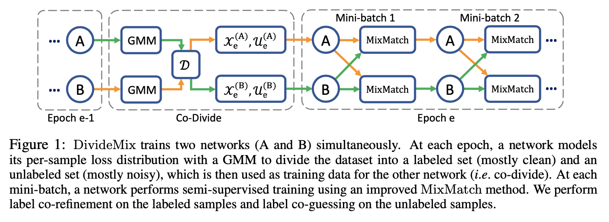
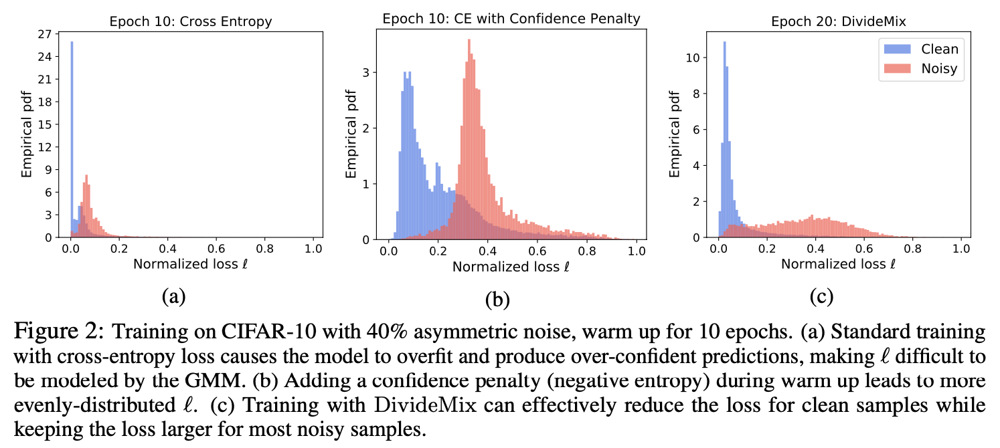
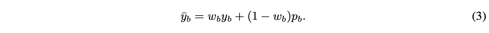
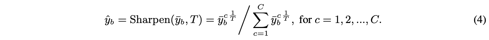
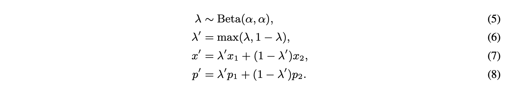
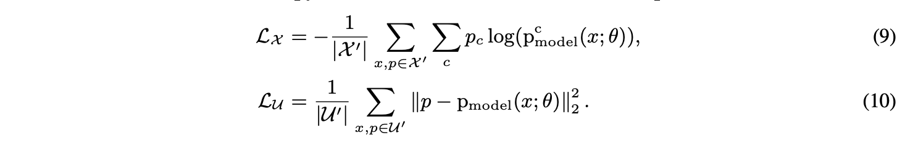

# Dividemix: Learning with Noisy Labels as Semi-Supervised Learning

DivideMix 是一个标准的样本筛选+半监督耐噪方法：

* 样本筛选方法：GMM-loss 用于区分是否是噪声样本；
* 半监督方法：MixMatch。

具体分为四个阶段：

* Co-divide：在 co-teaching 的两个 peernet 上各自使用 GMM 判别每个样本属于干净样本的概率 $w_i$；
* Co-refinement：对于干净样本，$M$ 个数据增强的预测标签和原标签按 $w_i$ 加权；
* Co-guessing：对于噪声样本，平均两个 peernet 的 $M$ 个数据增强的预测标签；
* MixMatch：随机两个样本做线性差值，得到新的样本和样本标签。

四个 trick：

* 防止模型 warmup 阶段过度自信的 confidence penalty；
* 对 co-refinement 和 co-guessing 得到的标签使用锐化函数，也就是 temperature parameter；
* 使用正则化项防止模型把所有样本预测为同一类。
* 干净样本和它们的 co-refinement 使用 CE 计算损失，噪声样本和它们的 co-guessing 使用 MSE 计算损失。
* CE 和 MSE 的比例随训练进程发生改变。

## 1 Introduction

尽管 LNL 和 SSL 有各自的进步，但它们之间的联系尚未得到充分探索。 DivideMix 以半监督的方式解决了标签噪声的学习问题。 与大多数现有的 LNL 方法不同，DivideMix 丢弃了很可能有噪声的样本标签，并利用噪声样本作为未标记数据来规范模型以防止过度拟合并提高泛化性能。 这项工作的主要贡献是：

* 提出了 co-divide，它同时训练两个网络。对于每个网络，我们在其每样本损失分布上动态拟合高斯混合模型 (GMM)，以将训练样本分为标记集和未标记集。然后使用划分的数据来训练另一个网络。 Co-divide 使两个网络保持发散，以便它们可以过滤不同类型的错误并避免自我训练中的确认偏差。
* 在 SSL 阶段，通过 co-refinement 和 co-guessing 来改进 MixMatch，以解决标签噪声问题。对于带标签的样本，使用由 GMM 引导的网络对另一个网络的预测来改进它们的原标签。对于未标记的样本，使用两个网络的集合来对其标签进行可靠的猜测。

## 2 Related Work

### 2.1 Learning with Noisy Labels

### 2.2 Semi-Supervised Learning

目前最先进的 SSL 方法主要是在未标注的数据上增加额外的损失项，也就是正则项，以调整模型。正则化分为两类：

* 一致性正则化，consistency regularization，强制模型对增强的输入数据产生一致的预测；
* 熵最小化，entropy minimization， 鼓励模型对未标记的数据进行高置信度的预测。

MixMatch 则是一种将一致性正则化、熵最小化和 MixUp 统一到一个框架中的方法。

```
关于一致性正则化：
Samuli Laine and Timo Aila. Temporal ensembling for semi-supervised learning. In ICLR, 2017.
Antti Tarvainen and Harri Valpola. Mean teachers are better role models: Weight-averaged consistency targets improve semi-supervised deep learning results. In NIPS, pp. 1195–1204, 2017.
Takeru Miyato, Shin-ichi Maeda, Masanori Koyama, and Shin Ishii. Virtual adversarial training: A regularization method for supervised and semi-supervised learning. IEEE Trans. Pattern Anal. Mach. Intell., 41(8):1979–1993, 2019.
关于熵最小化：
Yves Grandvalet and Yoshua Bengio. Semi-supervised learning by entropy minimization. In NIPS, pp. 529–536, 2004.
Dong-Hyun Lee. Pseudo-label: The simple and efficient semi-supervised learning method for deep neural networks. In ICML Workshop on Challenges in Representation Learning, volume 3, pp. 2, 2013.
MixMatch 和 MixUp：
David Berthelot, Nicholas Carlini, Ian J. Goodfellow, Nicolas Papernot, Avital Oliver, and Colin Raffel. Mixmatch: A holistic approach to semi-supervised learning. NeurIPS, 2019.
Hongyi Zhang, Moustapha Cisse ́, Yann N. Dauphin, and David Lopez-Paz. mixup: Beyond empirical risk minimization. In ICLR, 2018.
```

## 3 Method

### 3.1 Co-Divide by Loss Modeling



Two-components Beta Mixture Model (BMM) 也可以拟合最大归一化损失以模拟干净和嘈杂样本的分布。 然而，BMM 往往会产生的分布过于平坦，并且当标签噪声不对称时效果不好。 相反，高斯混合模型 (GMM) 可以更好地区分干净和嘈杂的样本，因为它具有分布锐度的灵活性。 因此，DivideMix 使用 EM 算法将双分量 GMM 拟合到样本损失。


```
关于 BMM：
Eric Arazo, Diego Ortego, Paul Albert, Noel E. O’Connor, and Kevin McGuinness. Unsupervised
label noise modeling and loss correction. In ICML, pp. 312–321, 2019.
```

**Confidence Penalty for Asymmetric Noise.** 对于算法的初始收敛，需要通过使用标准交叉熵损失对所有数据进行训练来“预热”模型几个 epoch。 预热对对称（即均匀随机）标签噪声有效。 然而，对于非对称（即类条件）标签噪声，网络在热身期间会很快过拟合噪声并产生过度自信（低熵）的预测，这导致大多数样本的归一化损失接近于零（见图 2a） . 在这种情况下，GMM 无法根据损失分布有效区分干净和嘈杂的样本。 为了解决这个问题，我们通过在热身期间的交叉熵损失中添加一个负熵项 -H 来惩罚来自网络的自信预测。 模型对输入 x 的预测的熵定义为：


通过最大化熵，样本损失变得更加均匀分布（见图 2b）并且更容易被 GMM 建模。 此外，图 2c 展示了当模型在热身后使用 DivideMix 再训练 10 个 epoch 时的情况。 所提出的方法可以显着降低干净样本的损失，同时保持大多数噪声样本的损失更大。



### 3.2 MixMatch with Label Co-Refinement and Co-Guessing

在每个 epoch，划分训练数据后，我们一次训练两个网络，同时保持另一个网络固定。给定一小批带有相应单热标签和干净概率的标记样本，$\{(x_b, y_b, w_b); b ∈ (1, ..., B)\}$，以及一小批未标记样本 $\{u_b; b ∈ (1, ..., B)\}$，我们利用 MixMatch 进行 SSL。 MixMatch 通过将一致性正则化（即鼓励模型对受扰动的未标记数据输出相同的预测）和熵最小化（即鼓励模型输出对未标记数据的置信预测）与 MixUp（Zhang 等人，2018）增强相结合来利用未标记数据（即鼓励模型在样本之间具有线性行为）。

**对于 MixMatch 的两项改进：**

首先，根据另一个网络产生的干净概率 $w_b$，通过将真实标签 $y_b$ 与网络的预测 $p_b$ （在 $x_b$ 的多个增强中平均）线性组合来对标记样本执行标签协同改进：



然后应用锐化函数来降低它的温度：



第二，我们使用两个网络的 co-guess 来集成预测未标注样本，让标签更可靠。

在获得了由标记（未标记）样本及其 co-refining（co-guessing）标签的多个增强组成的 $\hat X$（和 $\hat U$）之后，遵循 MixMatch 来“混合”数据，其中每个样本与随机选择的另一个样本进行插值。 具体来说，对于一对样本 $(x1, x2)$ 及其对应的标签 $(p1, p2)$，混合 $(x', p')$ 的计算公式为：



用交叉熵计算 $\mathcal X'$ 的损失，用均方误差计算 $\mathcal U'$ 的损失。



在高噪声水平下，网络可能把所有样本预测为同一类以最小化损失。为了防止这种情况，DivideMix 应用了增则项 $L_{reg}$，它使用均匀的先验分布 $π$（即 $π_c = 1/C$）来规范模型在小批量中所有样本的平均输出: 


最终总损失如下: 


其中, 在训练过程中 $\lambda_r$ 固定为 1, $\lambda_u$ 随训练进程改变。具体改变方式如下：
$$
\lambda_u = clip (\frac{current-warm\_up}{rampup\_length} ,0,1) * lambda\_u
$$
其中 warm_up 是模型预测的 epoch 数，cifar10 为 10，cifar100 为 30，ramped_length 和 lambda_u 是超参数，分别为 16 和 25。
