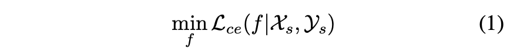
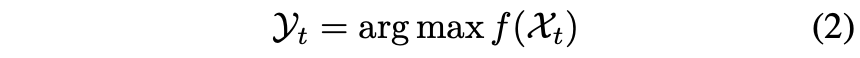
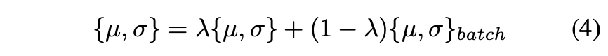
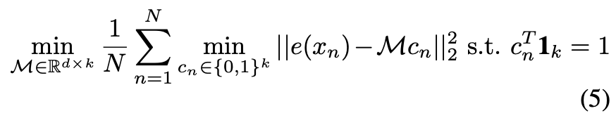
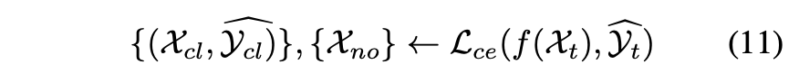
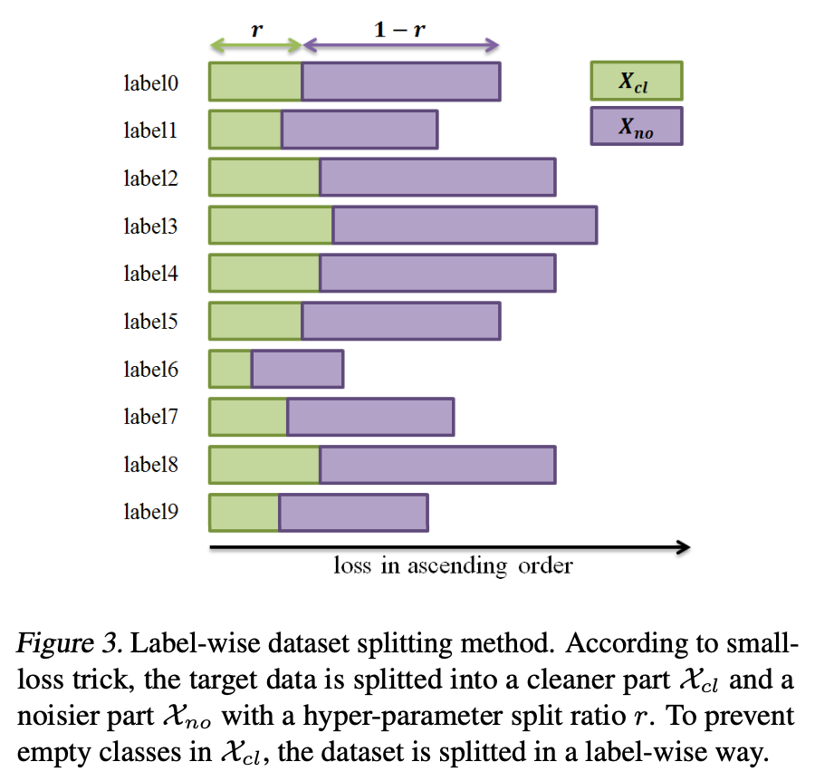
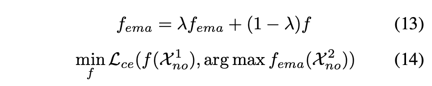
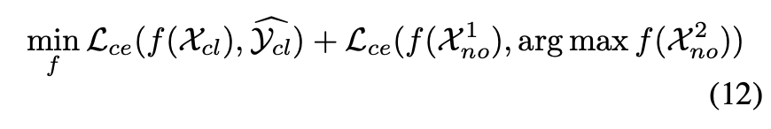

# Self-Supervised Noisy Label Learning for Source-Free Unsupervised Domain Adaptation

## 1 Introduction

在实际应用中，在源域上训练的深度模型通常部署在边缘设备中，以测试来自未知目标域的未标记图像。由于不可知的域转移，例如不同的光照、复杂的天气等，目标域的数据分布与源域有很大的不同。这是现实世界场景中模型性能下降的主要因素。这也就是无监督域适应 unsupervised domain adaptation（UDA）问题。

大多数以前的 UDA 方法旨在将标记的源数据和未标记的目标数据对齐在一个共同的表示空间中，以便在源域上训练的分类器可以很好地泛化到目标域。这些 UDA 方法假设源数据是可访问的，因此可以与目标数据一起用于域传输。然而，它在一些实际应用中并不适用，例如，由于数据传输和数据隐私保护导致的源数据不可访问，只有在源域上预训练的模型可用。这种情况被称为 source-free UDA，其中仅提供未标记的目标数据用于模型优化。

如何解决 source-free UDA？尽管预训练模型在目标域上表现不佳，但它仍然包含任务的信息线索，它可以被用来通过网络推理为目标数据预先生成伪标签。但是，预先生成的标签并不完全正确，其中错误标签的标签可以被视为噪声标签。这样 source-free UDA 也可以看作是另一种带噪学习。从这个角度来看，我们提出了一种简单而有效的方法，称为自监督噪声标签学习 Self-Supervised Noisy Label Learning（SSNLL）来解决这个问题。

## 2 Related Work

**Unsupervised Domain Adaptation** 普通无监督域自适应是指模型在标记的源数据和未标记的目标数据上联合训练，然后源域的知识可以自适应地转移到目标域，而无需任何额外的注释。在早期阶段，提出了一些基于差异的方法来最小化两个域的定义明确的距离损失函数（Long et al., 2015; Sun & Saenko, 2016; Haeusser et al., 2017）。具体来说，对抗学习也用于 UDA，其中域间隙通过梯度反转层 (Ganin & Lempitsky, 2015)、生成对抗网络 (Liu & Tuzel, 2016; Bousmalis et al., 2017; Hoffman 等人，2018）或混合方法（Saito 等人，2018c；Shu 等人，2018）。

但是，由于数据传输和数据隐私保护的限制，会出现一些特殊情况，即源数据不可访问，只有源域预训练模型可用。这种无源 UDA 问题可以被认为是无监督的目标域学习，由于监督信息较少，比普通 UDA 更难解决。模型自适应 (Li et al., 2020) 采用源模型作为 GAN 的辅助分类器来合成目标风格的虚假图像，这些虚假图像用于微调源分类器。 SHOT-1M (Liang et al., 2020) 利用 DeepCluster (Caron et al., 2018) 生成伪标签微调源模型。与上述方法不同，我们将无源 UDA 视为噪声标签学习任务，从而缓解了问题并取得了优异的性能。

**Noisy Label Learning** 在嘈杂的标签学习中发现了一种称为记忆效应的现象，即深度网络容易拟合简单（干净）样本，并逐渐过度拟合困难（嘈杂）样本（Arpit et al., 2017）。因此，提出了样本选择来通过根据一些规则选择干净的样本来解决噪声标签学习问题（NLL）。 SELF (Nguyen et al., 2020) 使用集成网络输出和标签之间的预测一致性来过滤掉带有噪声标签的样本。此外，研究人员采用了另一种样本选择标准，即小损失技巧，将损失小的样本视为干净样本，仅对此类样本进行反向传播以更新网络参数。 MentorNet (Jiang et al., 2018) 将课程学习引入 NLL，通过使用导师网络提供有关如何为学生网络选择小损失样本的课程。 Meta-weight-net (Shu et al., 2019) 构建了一个 meta-net 来为每个样本分配权重，其中小损失样本往往被分配更大的权重，反之亦然。 Co-teaching (Han et al., 2018) / Co-teaching+ (Yu et al., 2019)同时训练两个网络，每个网络从同一批中选择一定数量的小损失样本。然后，通过反向传播其对等网络选择的样本来更新每个网络。在本文中，我们在无源 UDA 任务中采用小损失技巧，将目标数据集简单地划分为更干净的子集和噪声更大的子集。与其他作品的不同之处在于我们保留而不是丢弃嘈杂的子集。此外，我们开发了一种基于标签的数据集拆分方法，以避免模型崩溃。

**Self-Supervised Learning** 在没有人工标注标签的任何监督的情况下，大多数自我监督学习工作 (SSL) 促进了对比学习方法，该方法迫使模型将锚点与其正面图像和负面图像区分开来（He et al., 2020; Chen et al. ., 2020a)。与对比学习不同，DeepCluster 在通过 k-means 对特征进行聚类和通过将聚类分配预测为判别损失中的伪标签来更新网络之间进行迭代。为了避免将所有样本特征存储在DeepCluster中带来的内存成本和效率低下，提出了一种更简单的方法，即无监督图像分类（UIC），使用softmax层而不是k-means来生成伪标签，其中softmax被认为是隐式聚类函数（Chen 等人，2020b）。它在每个时期的伪标签生成和网络优化之间进行迭代。在本文中，我们遵循 UIC，使用自生成的伪标签来细化噪声子集，同时使用预生成的噪声标签来规范和防止 UIC 模型崩溃。

## 3 Method

### 3.1 Problem Setup

Source-free UDA 遵循一个两阶段框架。

首先在原数据集上训练模型 $f$：



然后我们要在无标签的目标数据集 $\mathcal X_t$ 上优化这个预训练模型 $f$。在这篇论文中，这被转化为一个带噪学习任务。我们先用 $f$ 生成噪声标签 $\mathcal Y_t$ ：



这样一来，source-free UDA 的第二阶段就转化为了如何在噪声数据集 $(\mathcal X_t, \mathcal Y_t)$ 上微调 $f$ 的问题了。不同于传统的带噪学习任务，在 source-free UDA 中，$f$ 是一个在有标签源数据上训练的预训练模型，而噪声标签是由模型自然生成而不是人为导致或者随机设置的。

### 3.2 Label Denoising Preprocessing

我们能够在微调 $f$ 之前就修正这些由 $f$ 生成的噪声标签 $\mathcal Y_t$ 吗？如果可以的话，更低的噪声率就会有更好的微调，更好的微调又会带来更低的噪声率。这篇文章用了两个 trick 来对 $\mathcal Y_t$ 进行去噪：

**Adaptive Batch Normalization**

```
AdaBN: Li, Y., Wang, N., Shi, J., Liu, J., and Hou, X. Revisit- ing batch normalization for practical domain adaptation. Pattern Recognition, 80, 2016.
```

BN 层会保存训练数据集在节点的输入的均值和方差。但是现在目标数据集和源数据集的均值和方差可能有所不同，调整 BN 层的这两个参数可以让模型在目标数据集上做出更准确的预测，产生更准确的伪标签。具体的做法如下：



其中 $\{\mu,\sigma\}_{batch}$ 表示目标数据集上一个 batch 的均值和方差，$\{\mu,\sigma\}$ 表示训练数据集原有的均值和方差。

**Deep Transfer Clustering**

```
Deep Transfer Clustering: Kai, H., Andrea, V., and Andrew, Z. Learning to discover novel visual categories via deep transfer clustering. In ICCV, 2019.
```

作者认为，即使到了新的域，模型的特征提取器也依然有效。作者用预训练模型对目标数据提取特征，再使用 k-means 进行聚类：



其中 $x_n$ 是样本特征，$e(\cdot)$ 是模型的特征提取器，$M$ 是各个聚类中心的坐标组成的矩阵，$c_n$ 是样本 $x_n$ 在各个类别上的分量，所以它满足和为 1。

用这种特征提取+聚类的方法为目标数据增加伪标签。

### 3.3 Self-Supervised Noisy Label Learning

作者用 small-loss trick 把带有伪标签的目标数据集分为两部分：



这种方法可能会带来样本不均衡，但是这篇论文认为只要不太严重就好。什么是太严重呢？就是干净数据集中完全不含某一类样本。为了避免这种情况，作者根据伪标签把样本分组，每组取出 small-loss 样本。



对于干净部分，直接用 CE 对模型进行优化。而噪声部分则按下式计算损失值：



这里用到了 EMA 使 teacher net 的参数保持更好的一致性，也就是 mean teacher。$\mathcal X^1_{no}$ 和 $\mathcal X^2_{no}$ 表示同一个样本的两个数据增强。我认为，这里可以考虑使用 fixmatch 的强增强和弱增强。

```
Mean Teacher: Tarvainen, A. and Valpola, H. Mean teachers are better role models: Weight-averaged consistency targets improve semi-supervised deep learning results. In NeurIPS, pp. 1195–1204, 2017.
```

每个 iteration 都计算一个 batch 中干净样本的 CE loss 和噪声样本的 consistency loss 的和：




