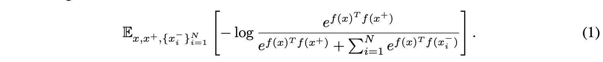

# Debased Contrastive Learning

## Abstract

自监督表示学习的一项突出技术是对比语义相似和不相似的样本对。 在没有标签的情况下，不同的（负）点通常被认为是随机采样的数据点，隐含地接受这些点实际上可能具有相同的标签。 也许不足为奇的是，我们观察到，在标签可用的合成环境中，从真正不同的标签中采样负样本可以提高性能。 受此观察的启发，我们开发了一个去偏对比目标，即使不知道真实标签，也可以校正相同标签数据点的采样。 根据经验，所提出的目标在视觉、语言和强化学习基准中始终优于表示学习的最新技术。 从理论上讲，我们为下游分类任务建立了泛化界限。

## 1 Introduction

在没有监督的情况下学习良好的表示一直是机器学习的长期目标。 其中一种方法是自我监督学习，其中辅助学习目标利用标签，无需人工标注即可观察到。 例如，在计算机视觉中，表示可以从着色 [45]、预测变换 [10、32] 或生成建模 [24、14、3] 中学习。 在语言领域也取得了显着的成功[30,25,8]。

最近，使用对比损失的自监督表示学习算法甚至超过了监督学习[15,28,19,18,2]。 对比学习的关键思想是对比语义上相似（正）和不相似（负）的数据点对，鼓励相似对 (x, x+ ) 的表示 f 接近，以及不同对 (x, x− ) 更加正交 [33, 2]：

在实践中，期望被经验估计取代。 对于每个训练数据点 x，通常使用一个正样本（例如，从扰动派生）和 N 个负样本 x−i。 由于真正的标签或真正的语义相似性通常不可用，因此通常从训练数据中统一抽取负对应 x-i。 但是，这意味着 x− 实际上可能与 x 相似，如图 1 所示。这种现象，我们称之为采样偏差，在经验上会导致性能显着下降。 图 2 比较了学习与这种偏差的准确性，以及从具有与 x 真正不同标签的数据中绘制 x-i 的准确性； 我们将这种方法称为无偏方法（5.1 节中有更多详细信息）。

然而，理想的无偏目标在实践中是无法实现的，因为它需要知道标签，即监督学习。这种困境提出了一个问题，即是否有可能在没有监督的情况下缩小理想目标和标准对比学习之间的差距。在这项工作中，我们证明了这确实是可能的，同时仍然假设只能访问未标记的训练数据和正例。特别是，我们对采样偏差进行了校正，该校正产生了一种新的、修改后的损失，我们称之为去偏对比损失。我们的方法背后的关键思想是间接近似负样本的分布。新目标很容易与任何优化标准对比损失的算法兼容。从经验上看，我们的方法在视觉、语言和强化学习基准方面都比现有技术有所改进。

我们的理论分析将去偏对比损失与监督学习联系起来：优化去偏对比损失对应于最小化监督损失的上限。当使用去偏对比损失进行训练时，这会导致监督任务的泛化界限。

简而言之，这项工作做出了以下贡献：

* 我们开发了一个新的、去偏的对比目标，它可以纠正负样本的采样偏差，同时只假设可以访问正样本和未标记的数据；

* 我们通过视觉、语言和强化学习方面的实验来评估我们的方法；
* 我们通过泛化提供了去偏对比表示的理论分析
  保证生成的分类器。

## 2 Related Work

**Contrastive Representation Learning.** 对比损失最近已成为无监督表示学习中的一个重要工具，从而产生了最先进的结果。对比学习的不同方法之间的主要区别在于它们获得正样本对的策略。计算机视觉中的示例包括随机裁剪和翻转 [33]，或同一场景的不同视图 [40]。陈等人。 [2] 广泛研究各种数据增强方法。对于语言，Logeswaran 和 Lee [28] 将上下文句子视为正样本，以有效地学习句子表示。斯里尼瓦斯等人。 [37] 通过对比损失学习的表示提高了强化学习的样本效率。通过维护负面示例字典 [18, 4]，计算效率得到了提高。同时，Wang 和 Isola [42] 分析了渐近对比损失并提出了新的指标来衡量表示质量。所有这些作品都从 p(x) 中抽取负样本。

阿罗拉等人。 [1] 从理论上分析对比表示学习对下游“平均”分类任务的影响，并为标准目标提供泛化界限。他们也
指出抽样偏差是一个问题，但没有提出任何模型来解决它。

**Positive-unlabeled Learning.** 由于我们仅使用来自 p(x) 和正例的未标记数据来近似对比损失，因此我们的工作也与正例未标记 (PU) 学习有关，即仅从正例 (P) 和未标记 (U) 数据中学习。 PU 学习的常见应用是检索或异常值检测 [13,12,11]。 我们的方法与无偏见的 PU 学习有关，其中未标记的数据被用作负例，但适当地降低了权重 [26,12,11]。

虽然这些工作专注于零一损失，但我们在这里解决了对比损失，现有的 PU 估计器不能直接适用。

## 3 Setup and Sampling Bias in Contrstive Learning

对比学习假设访问语义相似的数据点对 (x, x+)，其中 x 来自 X 上的数据分布 p(x)。目标是学习一个嵌入 f : X → Rd ，它将观察 x 映射到半径为 1/t 的超球面上的一个点，其中 t 是温度缩放超参数。不失一般性，我们为所有理论结果设置 t = 1。
与 [1] 类似，我们假设一组表示语义内容的离散潜在类别 C，即相似对 (x, x+) 具有相同的潜在类别。用 ρ(c) 表示类的分布，我们得到联合分布 px,c(x, c) = p(x|c)ρ(c)。设 h : X → C 是分配潜在类标签的函数。那么 p+x (x′) = p(x′|h(x′) = h(x)) 是观察 x′ 作为 x 的正例的概率，并且 p−x (x′) = p(x ′|h(x′) ̸= h(x)) 负例的概率。我们假设类概率 ρ(c) = τ + 是一致的，让 τ - = 1 - τ + 是观察任何不同类的概率。
请注意，为了在实践中保持无人监督，我们的方法和其他对比损失仅从数据分布和“代理”正分布中采样，通过数据增强或上下文句子 [2, 28] 进行模仿。

